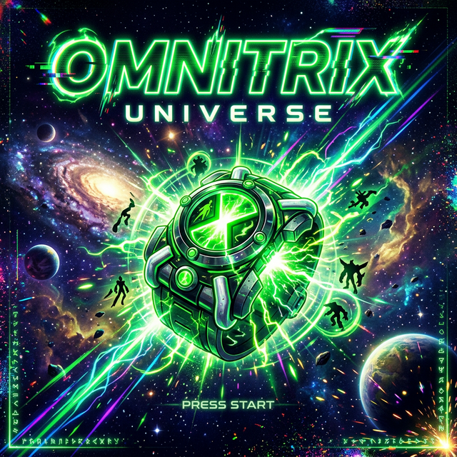

# 🛸 Omnitrix Universe



**Omnitrix Universe** is a cinematic, high-fidelity 2D arena combat game built with C++17 and the Simple and Fast Multimedia Library (SFML). Experience the power of the Omnitrix with fluid transformations, deep combat mechanics, and professional-grade visual feedback, all within a scalable and performant custom engine.

---

## 🎮 Features

* **Dynamic Transformations:** Experience seamless and cinematic shifting between forms, complete with bespoke particle effects, green energy bursts, and impactful screen trauma.
* **Intelligent Auto-Targeting Combat:** Engage in fast-paced combat where attacks intelligently snap to the nearest threat, maintaining a satisfying and fluid gameplay rhythm.
* **Kinetic Game Feel ("Juice"):** Enhanced game feel through meticulously timed hit-stops, procedural camera shakes, and localized screen flashes for maximum impact feedback.
* **Infinite Arena Survival:** Test your endurance against procedurally escalating swarms of dynamically spawned enemy archetypes, including Scouts, Tanks, and Grunts.
* **Advanced Shaders & Rendering:** Utilizes a custom rendering pipeline with embedded shaders, featuring a professional 2-pass Gaussian blur for stunning UI depth and visual fidelity.

---

## 🕹️ Controls

| Action | Input |
| :--- | :--- |
| **Movement** | `W`, `A`, `S`, `D` |
| **Attack** | `Space Bar` |
| **Quick Revert** | `R` |
| **Omnitrix Wheel** | Hold `V` |
| **Pause/Back** | `Escape` |

> **Developer/Debug Mode:** Type `1010` during gameplay to activate God Mode and instantly unlock all transformations.

---

## 🧱 Project Structure

The repository follows a clean, industry-standard C++ project layout:

```text
.
├── assets/         # Categorized media: audio, fonts, shaders, textures
├── bin/            # Output directory for compiled executables
├── build/          # Temporary object files during compilation
├── docs/           # System architecture and technical documentation
├── include/        # Public header files (.h) categorized by namespace
├── scripts/        # Automation and setup scripts (e.g., dependency installation)
└── src/            # Implementation files (.cpp)
```

---

## ⚙️ Build Instructions

The build system relies on standard GNU Make and requires SFML.

### Prerequisites

*   **Compiler:** GCC/G++ 9.0 or higher (C++17 support required)
*   **Dependencies:** SFML 2.5.1+ (`libsfml-dev`)

### Setup (Linux/macOS)

You can use the provided setup script to automatically fetch required dependencies:

```bash
chmod +x scripts/setup.sh
./scripts/setup.sh
```

### Compilation

Build the game using the provided Makefile. The compiled binary will be placed in the `bin/` directory.

```bash
# Standard Build (Debug mode)
make

# Optimized Release Build
make release

# Clean build artifacts
make clean
```

### Execution

```bash
# Run directly from the makefile
make run

# OR run the binary manually
cd bin && ./OmnitrixUniverse
```

---

## 📥 Downloads

Pre-compiled binaries for Linux and Windows are distributed with every major milestone.

👉 **Download available via [GitHub Releases](../../releases)**

*(Note: If running on Windows, ensure all SFML DLLs are present in the same directory as the `.exe` file.)*

---

## 🧠 Architecture Overview

The codebase is built on a custom Entity-Component-like architecture designed for maintainability and performance:

*   **Game Loop:** A robust, fixed-timestep loop (`Game.cpp`) managing state transitions, input processing, and rendering.
*   **Entity System:** Polymorphic actors (`Alien`, `Enemy`) encapsulate logic for AI steering, state machines, and physics.
*   **The Omnitrix Core:** A centralized module controlling transformation lifecycles, cooldowns, and form dispatching.
*   **Rendering Pipeline:** Layered drawing prioritizing spatial depth (Y-sorting), isolated particle systems, and a decoupled UI layer.

For a deeper dive, check out the full [Architecture Documentation](docs/architecture.md).

---

## 🚀 Future Improvements

*   **Refactored State Machine:** Transition from switch-based states to a formal State Pattern for Enemy AI.
*   **Asset Management System:** Implement an `AssetManager` singleton to optimize memory and eliminate redundant texture loading.
*   **Cross-Platform CI/CD:** Extend GitHub Actions to automatically cross-compile and deploy Windows binaries.

---

## 📄 License

This project is licensed under the [MIT License](LICENSE).